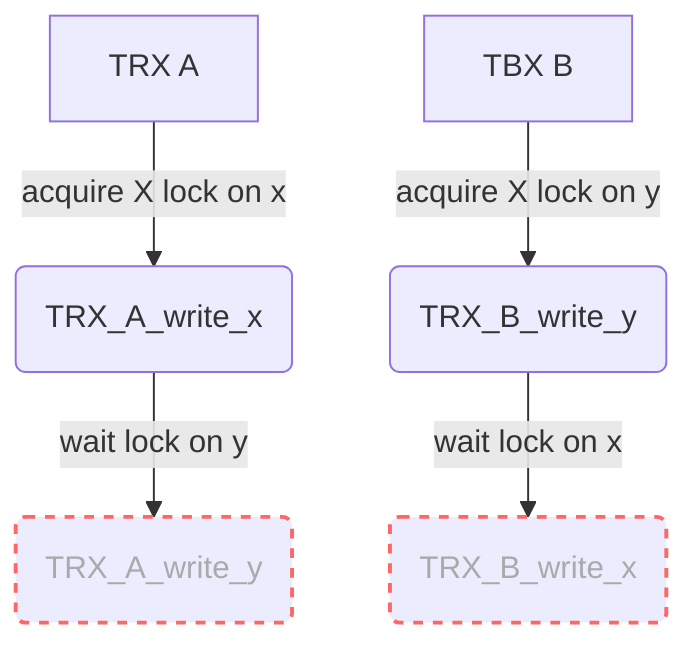
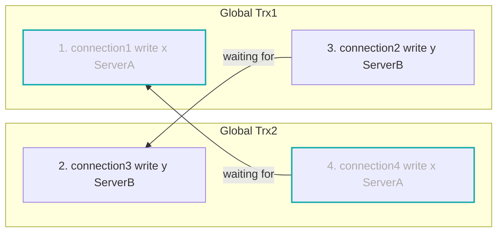
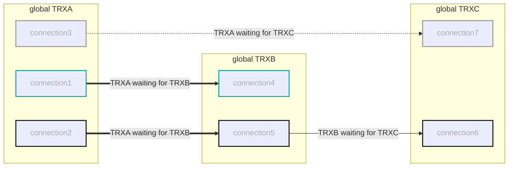
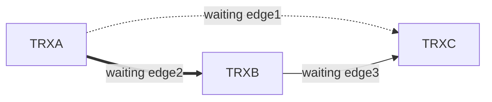

# **Distributed DataBase Dead Lock Handling In DBSCALE**

## **Dead Lock Sceniario**
### **Sceniario 1**
- TRX A: write data x on Site 1, write data y on site 2
- TRX B: write Data y on site 2, write data x on site 1


## **Dead Lock Detection**
### **MySQL Innodb locking and transaction related tables**
MySQL 5.7使用表**innodb_lock_waits**, 表**innodb_trx**, 表**innodb_locks**来记录innodb内部锁和事务相关的信息.

MySQL 8删除了**innodb_lock_waits**和**innodb_locks**.  
在**perofrmance_schema**中添加了两张表: **data_locks** 和**data_lock_waits**.  
因此**mysql8**必须要配置: 
```conf 
performance_schema = ON
```
**5.7**和**8**都有**sys.innodb_lock_waits** view来查询事务的等待关系.  

但是由于在大压力下，更新这几张表是比较消耗性能的，于是MySQL采取的策略是将三张表的内容保存到了一个**buffer**中.  
每100ms更新一次，并且每次更新都是以**原子**的方式同时更新这三张表,以保证对这三张表的**JOIN**等操作获取到的数据是一个**一致的快照(consistent snapshot)**.  
#### 1. **information_schema.innodb_lock_waits**
包括 **blocked innodb transactions**
```sql
mysql> select * from innodb_lock_waits;
+-------------------+-------------------+-----------------+------------------+
| requesting_trx_id | requested_lock_id | blocking_trx_id | blocking_lock_id |
+-------------------+-------------------+-----------------+------------------+
| 1900              | 1900:30:3:2       | 1899            | 1899:30:3:2      |
+-------------------+-------------------+-----------------+------------------+
1 row in set, 1 warning (0.00 sec)
```

#### 2. **information_schema.innodb_trx**
包括 innodb活跃的事务.  
其中记录一个事务**正在等待的锁**, **事务的开始时间**,**事务等待的开始时间**, **正在执行的语句**.

#### 3. **information_schema.innodb_locks**
包括这些记录:
> innodb事务还未获取到的锁.  
> innodb事务已经获取到的锁，并且这个锁阻塞了另一个事务.
```sql
/*事务1899 block住了 事务1900*/
mysql> select * from innodb_locks;
+-------------+-------------+-----------+-----------+-------------+------------+------------+-----------+----------+-----------+
| lock_id     | lock_trx_id | lock_mode | lock_type | lock_table  | lock_index | lock_space | lock_page | lock_rec | lock_data |
+-------------+-------------+-----------+-----------+-------------+------------+------------+-----------+----------+-----------+
| 1900:30:3:2 | 1900        | S         | RECORD    | `test`.`t1` | PRIMARY    |         30 |         3 |        2 | 1         |
| 1899:30:3:2 | 1899        | X         | RECORD    | `test`.`t1` | PRIMARY    |         30 |         3 |        2 | 1         |
+-------------+-------------+-----------+-----------+-------------+------------+------------+-----------+----------+-----------+
```

### **Get Lock waiting transactions from MySQL**
```sql
SELECT
r.trx_id waiting_trx_id,
r.trx_mysql_thread_id waiting_thread,
r.trx_query waiting_query,
b.trx_id blocking_trx_id,
b.trx_mysql_thread_id blocking_thread,
b.trx_query blocking_query
FROM information_schema.innodb_lock_waits w
INNER JOIN information_schema.innodb_trx b
ON b.trx_id = w.blocking_trx_id
INNER JOIN information_schema.innodb_trx r
ON r.trx_id = w.requesting_trx_id;

SELECT
waiting_trx_id,
waiting_pid,
waiting_query,
blocking_trx_id,
blocking_pid,
blocking_query
FROM sys.innodb_lock_waits;

mysql> SELECT waiting_trx_id, wait_age_secs, waiting_pid, waiting_query, blocking_trx_id, blocking_pid, blocking_query FROM sys.innodb_lock_waits;
+----------------+---------------+-------------+----------------------------+-----------------+--------------+----------------+
| waiting_trx_id | wait_age_secs | waiting_pid | waiting_query              | blocking_trx_id | blocking_pid | blocking_query |
+----------------+---------------+-------------+----------------------------+-----------------+--------------+----------------+
| 1900           |             2 |         328 | insert into t1 values(1,1) | 1899            |          327 | NULL           |
+----------------+---------------+-------------+----------------------------+-----------------+--------------+----------------+
1 row in set, 3 warnings (0.00 sec)
```

### **Detect Dead locks**
#### **1. Maintaining a Global Directed Waiting Map of blocking transactions**

**Global Trx A is waiting for Global Trx B**: 表现为在后端的某个或几个server上存在**Global事务A**的某个**单机事务**正在等待**Global事务B**的某个**单机事务**.  
因此在获取到单机事务的等待关系之后，需要转换为global事务的等待关系.  
计算节点维护此等待图.
#### **2. Acquiring lock waits from every backend node**
并发去后端获取每个server的lock waits信息.  
由于真正从后端获取数据的时间不可控制, 因此获取到的结果集可能是**不一致**的.    
即通过该结果集得到的死锁环可能事实上是不存在的.  
从后端获取该信息的频率是多少?  
用于**过滤**掉一部分等待时间较短的事务关系的阈值貌似只能以**秒**为单位 (**wait_age_secs**).  
#### **3. From Lock waits of one server to cluster dead locks**
需要从单机事务的等待关系转化为全局事务的等待关系.  
首先需要知道当前集群内**每个dbscale的所有事务**和**每个事务使用的连接的connection_id**, 汇集到master dbscale

从单机上的等待事务对应的**connection_id**找到对应的global 事务，每一条单机事务的等待线就是全局事务的一条等待线.  
其中通过单机事务的**connection_id**得到全局事务id可能比较麻烦.  
1. **需要知道每个全局事务使用了哪些server的哪些连接，这个信息分布在不同的dbscale上，如何同步？同步的时效性如何？**  
2. 需要快速的从一个server上的**connection_id**得到其所属的global 事务id.  
**master DBScale**拿着 **server名字**和**connection id**去其他dbscale查询该连接属于哪个session,这个session的当前的**trx_id**是多少?  
**trx_id**在XA情况下可以使用**xid**.  
此过程需要遍历每个dbscale上每个session, 每个session需要确定自己的**kept_connections**里有没有这个**connection_id**.  
每个session可以维护一个**set**记录自己当前所用的**connection_id**,只有在更新**kept_connections**时拿锁更新这个set.
3. 由于一个全局事务可能存在多个单机事务，因此可能出现以下情况:  

可以得到下图global事务等待图

其中**edge2**其实包含两条单机事务的等待edge, 在第五步reconfirm的时候需要确认的可能是这两条线，而不是一条线.  
#### **4. Searching for circles in Global Directed Watiing Map**
有向图环路检测算法. 
#### **5. Reconfirm the dead lock in backend servers**
由于并发去后端获取的锁等待关系在不同server可能不是一致的,  
因此根据当前确定的全局事务A,B,C...所构成的环之后，还需要去检查每一条全局等待edge下的所有单机事务等待edge是否还依然成立.  
检查过程中一条global edge只需要检查到一条单机事务等待edge满足条件就足够了.  
在重新检查过程需要确保当前再次确认的等待关系与之前所确认的是同一个等待关系.  
如何确定第二次得到的等待关系还是之前的那个等待关系?如果无法确定可能存在误伤.  
## **Dead Lock Breaking**
### **选择切断谁呢?**
### **How to break?**
可以直接从后端**kill id**.  
