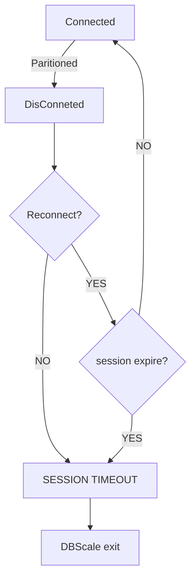
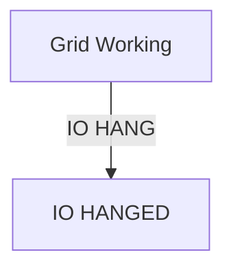

```mermaid
flowchart TD
    F[Connected] -->|Paritioned|A;
    A[DisConneted] --> B{Reconnect?};
    B -- YES --> C{session expire?};
    B -->|NO| E;
    C -- NO --> F;
    C -- YES --> E[SESSION TIMEOUT];
    E --> G[DBScale exit];
```

```mermaid
flowchart TD
  DW[Grid Working] -->|IO HANG| IH[IO HANGED];
```
