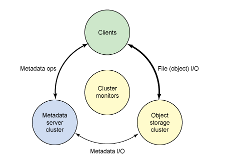
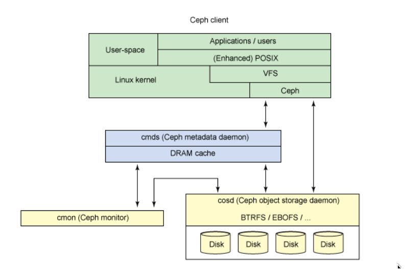

****

# Transactions Related

## Time, clocks, and the Ordering of Events in Distributed System

一个进程P就是分布式中的一个节点，每个进程内部的事件是可以排序的。  

### The Partial Ordering

定义关系`a ---> b`: `a`, `b`是两个事件  

- 如果`a`, `b`属于同一个进程P，并且a先，b后，那么`a ---> b`.  
- 如果`a`是进程P1中一个消息的发送事件, `b`是另一个进程P2中这个消息的接受事件, 那么`a ---> b`.  
- 如果`a ---> b`, `b ---> c`, 那么`a ---> c`.  
- 如果`a --/-> b`并且`b --/->a`, 那么a,b是并发的.  

### Logical Clocks

定义进程Pi在某个事件的时候会给这个事件分发一个逻辑时间.  
`Ci(a)`,表示Pi进程给事件a分发的逻辑时间.  
`C(b) = Cj(b)`当b是属于Pj的事件时成立.  

- 如果a和b属于同一个进程P, 并且a先,b后,那么Ci(a) < Ci(b);  
- 如果a是Pi的发送事件,b是Pj中这个消息的接收事件,那么Ci(a) < Cj(b);  

也就是如果a,b满足以上两个条件,那么也就满足:  
`a ---> b` 可以推出: `C(a) < C(b)`; 这就是`Clock Condition`  

于是只要能够保证两个事件a,b满足上面的两个条件中的任意一个,就可以保证满足`Clock Condition`.  

如何保证呢?  

- 每个进程给每个事件分发递增的逻辑时间.
- 如果Pi给时间a分发的逻辑时间:Tm=Ci(a), 在Pj给收到消息的事件分发的逻辑事件应大于等于自己分配的值,并且大于Ci(a);  

### Ordering the events totally

***

# Engine Related

## Modern B-tree techniques

### Basics

#### 关于B-tree的高度和算法

假设B-tree有$N$ records，$L$ records per leaf，那么B-tree拥有$N/L$个 leaf nodes。  
假设平均每个`branch node`拥有$F$个子节点, 那么`branch level`就是$log_F(N/L)$.  
比如一共9个叶子节点的（2-3）B-tree，每个branch node最多3个指针。  
$F=3$, $log_3 9 = 2$,一层branch 节点，加一层root，叶子节点这一层不算。  
`搜索`  
单值搜索复杂度计算时主要看二分查找的比较次数，直观上看需要：

- 在每个`branch node`需要比较的次数和每个node最多存放多少个指针相关, 可以记为: $log_2 F$，其中$F$为指针个数, 一共会经过$log_F(N/L)$个`branch node`, 因此一共进行了$log_F(N/L) \times log_2 (F)$此比较.  
- 在每个`leaf node`需要比较的次数和叶子节点中records的个数相关，可以记为: $log_2 (L)$, $L$为叶子节点records的个数.  
- 于是就有了总复杂度就是: $log_F(N/L) \times log_2 (F) + log_2 (L)$.  
可以整理为: $=log_2 (N/L) + log_2 (L) = log_2 (N)$  
- 因此影响比较次数的唯一因素就是`record count:` $N$  

如果是`range search`, 那么搜索就比较麻烦了，比如需要`父指针`, 此时可以使用`neighbor pointers`.  

- In order to exploit multiple asynchronous requests, e.g., for a B-tree index stored in a disk array or in network-attached storage, parent and grantparent nodes are needed.  
- Range scans relying on neighbor pointers are limited to one asynchronous prefetch at-a-time and therefor unsuitable for arrays of storage devices or for virtualized storage.

`插入`  
插入可能会导致`overflow`, 叶子会分裂成两个，parent需要插入一个新的node, 如果parent也`overflow`，那么这个过程一直向上传递, 如果传递到了root， 那么高度+1.  

上面说的这种分裂过程，`有的实现`会在传递到root的时候，会将老root节点作为新root，然后生成两个新的子node，将数据分布在这两个新的子node中.  

- This is a valuable technique if modifying the page identifier of the root node in the database catalogs in expensive or if the page identifier is cached in compiled query execution plans.  

`有些实现`会尽量延迟分裂操作,比如通过`load balancing among siblings`.  

`删除`  
`underflow`, 可以通过`load balancing`或者`merging with a sibling node`来使得除了root的所有节点都至少半满.  
`merging two sibling`可能会导致他们的parent `underflow`, 因此可能merge操作需要向上传递  
和`insert`一样，如果传递到root，那么高度-1.  
`有些实现`避免了`load balancing`以及`merging`的复杂度，而是不管`underflow`.接下来的插入或者`defragmentation`会解决`underflow`. 有文章认为periodic rebuilding of the tree is theoretically superior to standard $B^+$-trees, 并且在删除时做rebalancing 是有害的.  
`paper: Deletion without rebalancing in multiway search trees`

`更新`  
更新一般是删除原始数据和插入新数据两步.  
如果是`fixed-length fields`那么可以原地更新, 如果是`variable-length fields`那么更改可能会导致`overflow`或者`underflow`,那么行为类似于`insertion`或者`deletion`.  

`B-tree Creation`  

- random insertions
- prior sorting  

# Distributed Storage Related

## Google File System
`key words`: 
- Big, Fast
- Global
- Sharding 
- Automatic recovery
- Deployed in Single data center
- Big sequential access(not random)
- Relaxed consistency model

Most files are mutated by appending rather than overwriting existing data.  
Randon writes are practically non-existent.  
Once written, the files are only read, and often sequentially.  

### `CLIENTS`
Neither the client nor the chunkservers caches file data.  
clients do cache metadata.  

### `Master Server`  
GFS have one `single master`.  
all meta data is kept in master's memory.  
Master Data  
- namespace
- access control information
- file name -> array of chunk handles
- chunk locations  
Master does not keep a persistent record of which chunkservers have a replica of a given chunk.  
It simply polls chunkservers for that info at startup.  
The master can keep itself up-to-date thereafter, 因为他控制了所有的chunk分配, 并且在monitor过程中通过HeartBeat Message更新这些信息.  
- handle -> list of chunk servers  
version number for every chunk server  
who is the primary chunk server and it's lease expiration time.  
- write LOG, CHECKPOINTS to Disk  
Logs are replicated on multiple remote machines.  
Master Server will respond to a client operation only after flushing the corresponding log record to disk both locally and remotedly.  
The Master batches several log records together before flushing.  
The Master checkpoints its state whenever the log grows beyond a certain size.  
The checkpoint is in a compact B-tree like form and can be directly mapped into memory.  
创建检查点的时候不影响正常的file mutations, 创建新的检查点时,master会切换一个log file, 并且使用一个新线程来创建检查点, 因此新的检查点会包含在此之前的所有mutation.  
创建检查点结束之后,会被写入本地磁盘以及远程磁盘.  
恢复的时候只需要读取最近的检查点,并且应用之后的日志.  

`Namespaces` and `file-to-chunk mapping` are also kept persistent by logging mutations to an `operation log` stored on the master's local disk and replicated on `remote machines`.  

`chunk locations` is only in memory.  

Master Functions  
- chunk lease management
- garbage collection of orphaned chunks
- chunk migration between chunkservers
- using heartbeat messages to monitor and instruct the chunkservers and collect states

`READ OPERATION`  
1. name, offset ----> Master Server
2. Master Server Sends chunk handle and list of chunk servers to client  
client can cache the results  
3. Client talk to the chunk servers
4. chunk server returns the data

`WRITE OPERATION`  
If no Primary on Master Server:  
- Find up to date replicas
- Pick one as primary, others as Secondaryes
- increments the version number of this chunk
- tell the primary and secondarys the new version number, and a lease
- Master writes version number to it's own disk
- master tells the client the primary and the secondarys chunk servers  

now client knows who to talk to  
- client talk to the primary to append the data
- primary picks the offset to append the data
- all replicas told to write data at the offset  
if all "succeed" then return to client OK  
else return NO to client

### `SNAPSHOT AND RECORD APPEND`  

### `CONSISTENCY MODEL`
A relaxed consistency model.  

Guarantees by GFS
- File namespace mutations(e.g., file creation) are atomic.  
They are handled exclusively by the master. (namespace locking)  
执行顺序由master写入的日志顺序来确定.  
- CONSISTENT
- DEFINED
- UNDEFINED
- UNCONSITENT

***

## ceph

### Architecture

Ceph can be divided into four segements:  

- `clients`, users of the data,
- `metadata servers`, which cache and synchronize the distributed metadata
- `object storage cluster`, which stores both data and metadata as objects and implements other key responsibilities
- `cluster monitors`, which implement the monitoring functions.

metadata servers manage the location of data and also where to store new data.  
Metadata is stored in the storage cluster(as indicated by Metadata I/O).  
Higher level POSIX functions(such as open, close, rename) are managed through the `metadata servers`, whereas POSIX functions(such as read and write) are managed directly through the object `storage cluster`.  

The distributed storage system can be viewed in a few layers, including a **format for the storage devices**(the **Extent and B-tree-based Object File System**[EBOFS] or an alternative) and an **overriding management layer** designed to **manager data replication failure detection and recovery and subsequent data migration** called **Reliable Autonomic Distributed Object Storage**(RADOS).

`Ceph Client`  
A file is assigned an `inode number` (INO) from the meta dataserver, which is the unique identifier for the file.  
The file is carved into some number of objects(based on the size of the file) with different `object number`.  
`Object ID` OID is assigned accoring to the INO and ONO.  

Using a simple hash over the OID, each object is assigned to a `placement group`.  

The `placement group (PGID)` is a conceptual container for objects.  

The mapping of `placement group` to object storage devices is a pseudo-random mapping using an algorith called `Controlled Replication Under Scalable Hashing(CRUSH)`.  

`Ceph Metadata Server`  

Metadata server(cmds) is to manage the filesystem's `namespace`.  
MetaData server is actually a intelligent `metadata cache`.  

The metadata server transforms the file name into an inode, file size, and striping data(layout) that the Ceph client uses for file I/O.  

`Ceph Monitors`  
When object storage devices fail or new devices are added, monitors detect and maintain a valid cluster map. This function is performed in a distributed fashion where map updates are communicated with existing traffic. Ceph uses Paxos, which is a family of algorithms for distributed consensus.  

`Ceph object storage`  
B-tree file system (BTRFS) can be used at the storage nodes
***
